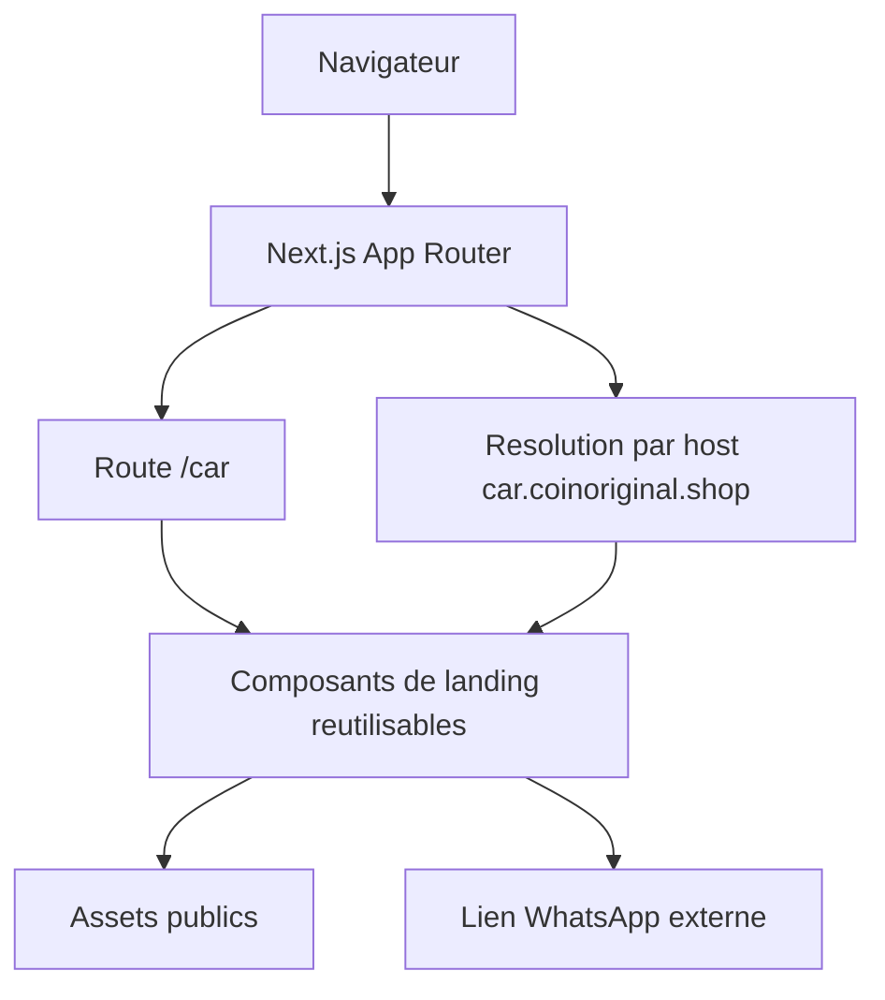

## 1. Architecture de la solution


## 2. Description technique
- Frontend : Next.js 16 + React 19 + TypeScript + Tailwind CSS 4
- Rendu : composants serveur par defaut avec logique minimale de presentation
- Style : fichier global existant + styles localises a la landing pour eviter les regressions sur la boutique
- Assets : `public/` pour les images locales, URLs externes seulement si necessaire
- Externe : WhatsApp comme canal de conversion, Cloudflare Pages comme publication du domaine

## 3. Definitions des routes
| Route | Usage |
|-------|-------|
| `/` | Page d'accueil existante de la boutique, conservee telle quelle |
| `/car` | Route interne de previsualisation et partage direct de la landing CarPlay |
| `car.coinoriginal.shop/` | Version sous-domaine de la landing, rendue a partir du meme composant |

## 4. Strategie de rendu du sous-domaine
- Lire le host de la requete cote serveur pour distinguer `car.coinoriginal.shop` du domaine principal
- Si le host est `car.coinoriginal.shop`, afficher directement la landing sur la racine `/`
- Conserver `/car` comme route explicite pour le dev local, les tests et le fallback
- Eviter une duplication de contenu en utilisant un composant principal unique pour les deux entrees

## 5. Structure cible
| Emplacement | Role |
|-------------|------|
| `src/app/car/page.tsx` | Route interne de la landing |
| `src/components/car-landing/` | Composants dedies a la landing |
| `src/components/car-landing/car-landing-page.tsx` | Composition principale de la landing |
| `src/app/page.tsx` ou `src/app/layout.tsx` | Point d'integration conditionnel selon le host |
| `public/` | Images optimisees si des assets locaux sont ajoutes |

## 6. Donnees et integrations
### 6.1 Modele de contenu
- Pas de base de donnees requise
- Contenu editorial local dans des constantes TypeScript
- Telephone WhatsApp, prix et FAQ centralises dans un module de donnees simple

### 6.2 Points de configuration
```ts
type CarLandingConfig = {
  brand: string;
  productName: string;
  currentPriceMad: number;
  oldPriceMad?: number;
  whatsappUrl: string;
  supportPhone: string;
  supportEmail: string;
  deliveryMessage: string;
};
```

## 7. Publication Cloudflare
- Option recommandee : garder un seul projet Cloudflare Pages et ajouter `car.coinoriginal.shop` comme domaine personnalise
- Le DNS peut etre configure en CNAME vers la meme cible Pages que le domaine principal
- Si Cloudflare pointe deja vers le projet principal, la logique applicative par host suffit pour afficher la landing sur le sous-domaine
- En cas de contrainte d'hebergement externe type sous-dossier, exporter une version statique plus tard reste possible, mais ce n'est pas la voie prioritaire pour ce projet Next.js

## 8. Risques et garde-fous
- Risque principal : casser la home existante si la logique de host est mal placee
- Garde-fou : isoler la landing dans ses propres composants et ne pas modifier la boutique en profondeur
- Risque visuel : regression mobile lors de l'adaptation desktop du template HTML
- Garde-fou : verifier explicitement les breakpoints et limiter les styles globaux
