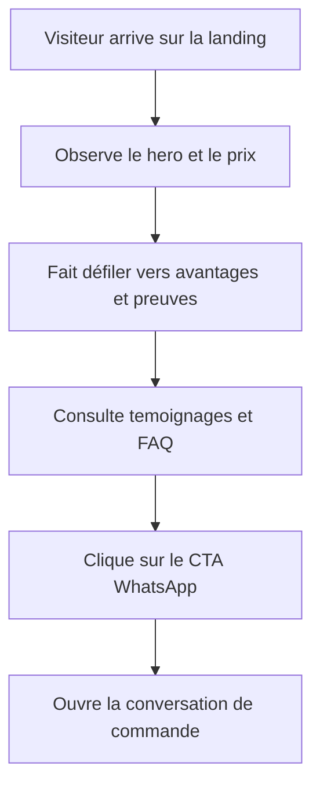

## 1. Vue d'ensemble du produit
Landing page premium dédiée à l'adaptateur CarPlay sans fil, inspirée du template fourni dans `c:\Users\hp\Desktop\projet\code`, intégrée au projet Next.js existant.
- Objectif principal : convertir le trafic froid en commandes WhatsApp avec un message simple, rapide et orienté performance produit.
- Valeur métier : disposer d'une page publicitaire isolée de la boutique principale, exploitable en campagne et publiable sur `car.coinoriginal.shop`.

## 2. Fonctionnalités coeur

### 2.1 Modules fonctionnels
1. **Landing page CarPlay** : hero produit, preuves de confiance, bénéfices, démonstration visuelle, témoignages, FAQ, CTA WhatsApp.
2. **Mode sous-domaine** : affichage de la landing comme page principale lorsque le host est `car.coinoriginal.shop`.
3. **Route interne de secours** : accès à la même landing via `/car` pour prévisualisation, test local et fallback si le sous-domaine n'est pas encore branché.

### 2.2 Détail des pages
| Nom de page | Nom du module | Description fonctionnelle |
|-------------|---------------|---------------------------|
| Landing CarPlay | Barre haute | Navigation compacte avec ancres vers avantages, témoignages, FAQ et contact |
| Landing CarPlay | Hero conversion | Message principal, promesse sans fil, prix actuel, ancien prix, CTA WhatsApp |
| Landing CarPlay | Preuves rapides | Statistiques visibles immédiatement pour rassurer sur la compatibilité, la rapidité et le support |
| Landing CarPlay | Blocs avantages | Arguments produit orientés usage réel en voiture et simplicité d'installation |
| Landing CarPlay | Galerie produit | Mise en scène visuelle immersive du produit et de son utilisation |
| Landing CarPlay | Témoignages | Avis clients Maroc avec ton crédible et géolocalisation légère |
| Landing CarPlay | FAQ | Réponses courtes sur compatibilité, latence et livraison |
| Landing CarPlay | CTA final | Bloc de conversion fort vers WhatsApp avec rappel du paiement à la livraison |
| Landing CarPlay | Footer contact | Téléphone, email, garanties, livraison Maroc |

## 3. Parcours coeur
L'utilisateur arrive depuis une publicité ou un lien direct, comprend immédiatement le bénéfice du produit, valide la preuve sociale, consulte les réponses aux objections principales puis clique sur le CTA WhatsApp pour commander ou poser une question.

## 4. Design de l'interface
### 4.1 Style visuel
- Direction : techno premium sombre, cinematique, dense, orientee conversion
- Couleurs principales : fond anthracite, bleu electrique froid, vert signal pour les CTA, blanc casse pour les textes
- Style des boutons : grands boutons forts, coins arrondis, contraste eleve, micro-effets lumineux
- Typographies : affichage impactant pour les titres, sans-serif moderne pour le corps, police monospace pour les labels techniques
- Mise en page : desktop-first, sections larges, visuels immersifs, cartes verre sombre et asymetrie controlee
- Iconographie : icones techniques sobres et indicateurs de confiance lisibles

### 4.2 Vue des modules UI
| Nom de page | Nom du module | Elements UI |
|-------------|---------------|-------------|
| Landing CarPlay | Hero conversion | Grand titre, badge techno, visuel produit, prix compare, CTA principal, preuve sociale |
| Landing CarPlay | Preuves rapides | Grille de stats, cartes sombre-verre, nombres tres visibles |
| Landing CarPlay | Blocs avantages | Cartes a bordure accent, icones, titres courts, textes rassurants |
| Landing CarPlay | Galerie produit | Grille asymetrique, images larges, profondeur visuelle, blocs texte de contexte |
| Landing CarPlay | Témoignages | Cartes d'avis avec etoiles, initials clients, ville |
| Landing CarPlay | FAQ | Accordions simples et lisibles |
| Landing CarPlay | CTA final | Grand panneau centre avec bouton principal et badge COD |

### 4.3 Responsivite
- Approche desktop-first, puis adaptation mobile sans casser l'existant de la boutique
- Sections hero et galerie doivent se replier proprement en une seule colonne sur petit ecran
- CTA toujours visibles et facilement cliquables au tactile
- Espacements controles pour conserver un rendu premium sur mobile

### 4.4 Contraintes d'integration
- La landing doit reutiliser le projet `ma-boutique` sans perturber la page d'accueil actuelle
- Le contenu doit pouvoir etre servi a la fois sur `/car` et sur `car.coinoriginal.shop`
- Les CTA doivent pointer vers WhatsApp et rester editables facilement
- Toute modification desktop doit preserver integralement l'experience mobile
